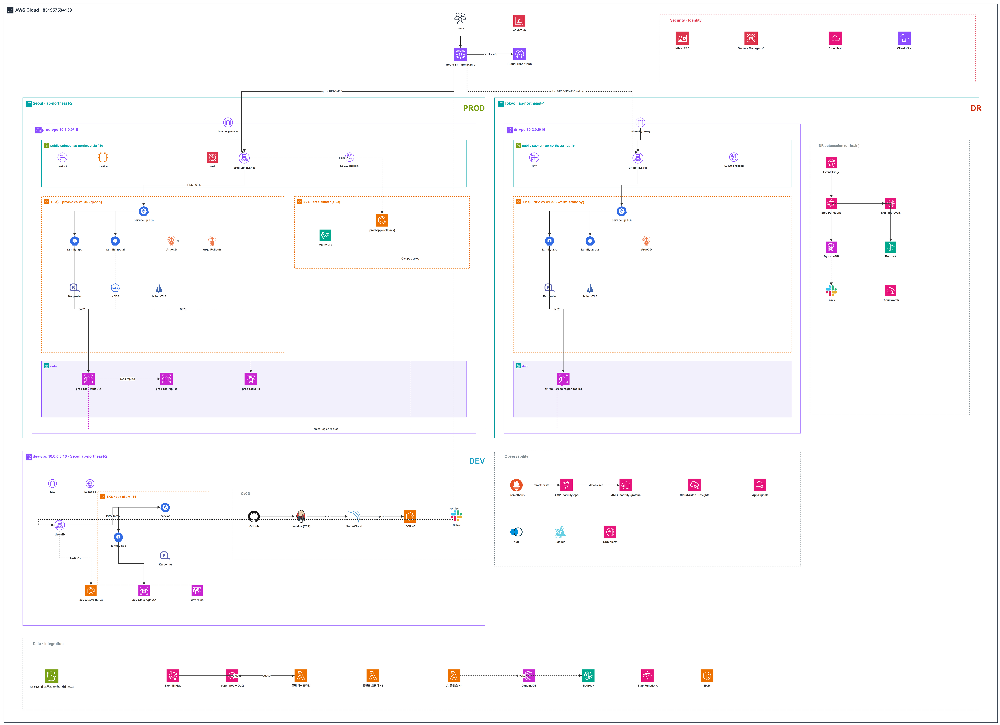
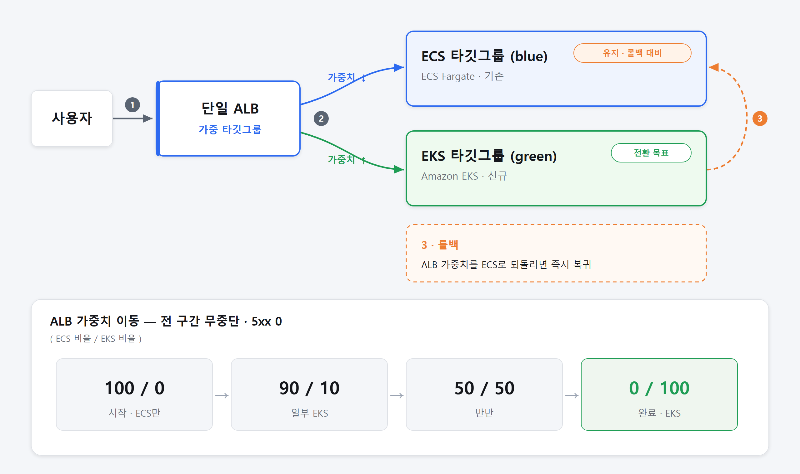
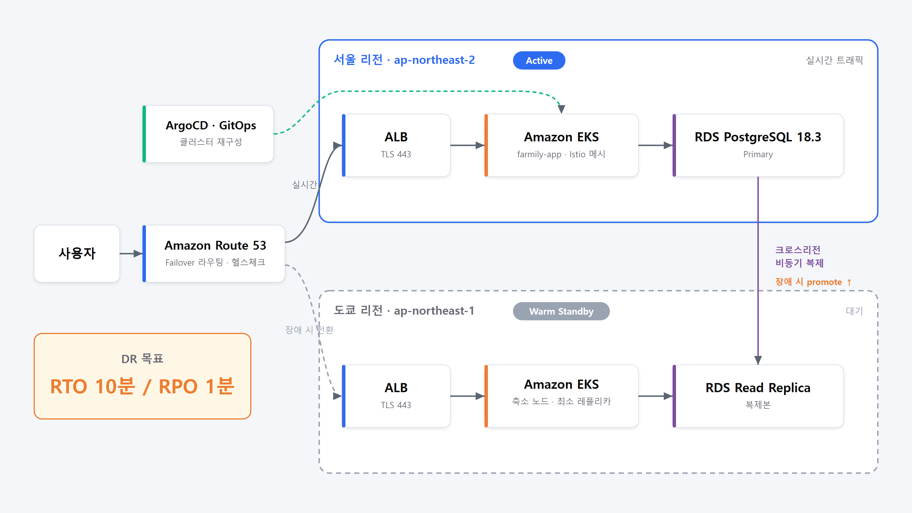

# 🌾 Farmily

### 농민을 위한 AI 기반 자동화 마케팅 앱

**AWS Cloud School 13기 · Urbanworkteam**

---

## 📖 프로젝트 소개

**Farmily**는 농민이 손쉽게 마케팅 콘텐츠를 만들고 판매를 자동화할 수 있도록 돕는 **AI 기반 마케팅 자동화 서비스**입니다.

24시간 무중단 서비스를 목표로, 컨테이너 인프라를 **ECS에서 EKS(Kubernetes)로 무중단 전환**하고, 서울 리전 장애에 대비해 **도쿄 리전 웜 스탠바이 재해복구(DR)** 체계를 구축했습니다. 배포·확장·복구를 오픈소스 도구로 자동화해 운영 부담을 최소화했습니다.

---

## 👥 팀원

<table>
  <tr>
    <td align="center">
      <a href="https://github.com/mins8578">
         
        <b>@mins8578</b>
      </a> 
      __역할__
    </td>
    <td align="center">
      <a href="https://github.com/__ID2__">
         
        <b>@__ID2__</b>
      </a> 
      __역할__
    </td>
    <td align="center">
      <a href="https://github.com/__ID3__">
         
        <b>@__ID3__</b>
      </a> 
      __역할__
    </td>
    <td align="center">
      <a href="https://github.com/__ID4__">
         
        <b>@__ID4__</b>
      </a> 
      __역할__
    </td>
    <td align="center">
      <a href="https://github.com/__ID5__">
         
        <b>@__ID5__</b>
      </a> 
      __역할__
    </td>
  </tr>
</table>

> 팀원 GitHub 핸들을 `__ID2__`~`__ID5__` 자리에 채우면 아바타·링크가 자동으로 뜹니다. (`https://github.com/아이디.png` 는 GitHub 기본 아바타 URL)

---

## 🏗️ 아키텍처

### 전체 플랫폼 (2-Region)

서울에 운영·개발, 도쿄에 재해복구 환경을 두고, `api.farmily.info` 는 서울을 쓰다 장애 시 도쿄로 넘어갑니다. 각 리전은 ALB가 EKS·ECS에 트래픽을 나누며, 현재 EKS 100% · ECS 0%(롤백 대기)입니다.

  

### ECS → EKS 무중단 전환 (블루그린)

ALB 가중 타깃그룹으로 ECS(blue) ↔ EKS(green) 트래픽을 `100:0 → 90:10 → 50:50 → 0:100` 으로 점진 전환했습니다. 문제 시 가중치를 되돌려 즉시 롤백할 수 있습니다.

  

### 재해복구 — 웜 스탠바이 (Seoul → Tokyo)

도쿄에 축소 복제본을 상시 가동하고, Route 53 헬스체크로 장애를 감지하면 RDS 복제본을 승격·확장해 복구합니다. AI(Bedrock)가 위험도를 요약하고, 실제 복구는 사람 승인 + Step Functions 절차로 실행합니다.

  

---

## ⚙️ 기술 스택

**Infra & Container**

**Deploy & Mesh & Observability**

**Data & Application**

---

## ✨ 핵심 성과

| 항목 | 결과 |
|---|---|
| **ECS → EKS 무중단 전환** | 전 구간(100:0 ~ 0:100) **5xx 오류 0건**, 데이터 손실 0, 즉시 롤백 가능 |
| **카나리 배포** | Argo Rollouts로 10% → 50% → 100% 지표 기반 자동 승격·롤백 (Prometheus 성공률) |
| **재해복구 (DR)** | **복구 시간(RTO) 7분 25초** · **데이터 유실(RPO) 4초** — 목표(10분/60초) 이내 달성 |
| **자동 확장** | Karpenter(노드) + KEDA(파드)로 트래픽 연동 오토스케일 |
| **보안 통신** | Istio STRICT mTLS로 파드 간 통신 자동 암호화, IRSA 기반 최소 권한 |

---

## 📦 레포지토리

| 레포 | 설명 | 스택 |
|---|---|---|
| [`Frontend`](https://github.com/urbanworkteam/Frontend) | 모바일/앱 프론트엔드 | TypeScript |
| [`Frontend-web`](https://github.com/urbanworkteam/Frontend-web) | 웹 프론트엔드 | TypeScript |
| [`Backend`](https://github.com/urbanworkteam/Backend) | API 백엔드 | Java |
| [`AI`](https://github.com/urbanworkteam/AI) | AI 마케팅 자동화 | Python |
| [`Infra`](https://github.com/urbanworkteam/Infra) | EKS·DR 인프라 (IaC) | Terraform (HCL) |

**AWS Cloud School 13기 · Urbanworkteam** · 🌾 *Farmily*

